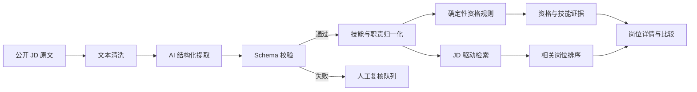

# AI 系统方案 v1.0

## 目标

把公开 JD 转换成可检索、可核对、可比较的数据，并保证每项 AI 输出都能追溯到原文。系统不预测录取概率，也不替用户决定是否投递。

## 处理链路

## AI、规则和用户的分工

| 参与者 | 负责 | 不负责 |
|---|---|---|
| AI 提取器 | 从 JD 提取职责、技能、要求级别、学历、专业、届次、地点及证据片段 | 自行放宽条件、推断未写出的要求 |
| 检索层 | 计算职责、技能、专业/领域和标题的相关性 | 输出录取概率 |
| 确定性规则 | 根据结构化字段判断明确的 pass/fail/unknown | 用相似度覆盖硬性冲突 |
| 生成模型 | 将已存在的证据组织为“为什么找到”和比较摘要 | 生成无证据理由 |
| 用户 | 核对模糊专业、地点偏好和最终决定 | 被系统强制接受推荐 |

## 四个 AI 子任务

### A1：JD 结构化提取

输入：岗位原文、公司、来源链接。  
输出：符合 `job-extraction-schema-v1.0.json` 的 JSON。

关键约束：

- 每个职责、技能和资格条件必须包含 `evidence_span`；
- 不明确时使用 `unknown` 或空数组；
- “优先”不能提取成 required；
- 不根据岗位名称补全 JD 未写的信息。

### A2：职责和技能归一化

将“数据统计分析”“经营数据洞察”等映射到可检索标签，同时保留原始词。技能同义词表第一版人工维护，例如 `PostgreSQL/MySQL → SQL`，但 `Python ≠ Java`。

### A3：岗位召回

采用混合检索：

1. 关键词和同义词匹配作为可解释基线；
2. 可选 embedding 处理职责语义相似；
3. 初始组合权重：职责 40%、技能 35%、专业/领域 15%、标题 10%；
4. 工作地点默认不参与相关性分数，用户主动选择后作为过滤条件；
5. 输出各子分数和命中证据，不只保存总分。

### A4：证据化解释与比较摘要

模型只能使用已经提取并通过校验的字段，生成：

- 为什么找到该岗位；
- 已覆盖技能；
- required/expected 技能缺口；
- 待核实条件；
- 多岗位共同点与独有要求。

## 资格规则

规则状态为 `pass/fail/unknown/not_applicable`。明确硬条件冲突才输出 fail；模糊的“相关专业”、缺失届次和未说明的证书关系均输出 unknown。

地点规则：默认检索全部地点；只有用户主动选择地点时过滤。个人意向地点是偏好，不自动构成 fail。

语言规则：英语不作为默认维度。JD 明示语言条件时进入 `other_explicit_conditions`，不进行 TOEFL/CET 自动换算。

## 数据流与可追溯性

每条岗位保存：原文、原文哈希、官方链接、采集日期、提取器版本、Schema 版本、提示词版本、结构化结果、人工修订记录。这样可以复现某条结论来自哪个版本。

## 失败降级

1. 模型不可用：读取人工核验或预计算 JSON；
2. JSON 不合法：重试一次，仍失败则进入人工复核；
3. 证据片段不存在于原文：拒绝该字段并标记 extraction_error；
4. 相关性解释无证据：不展示解释，只显示命中的结构化标签；
5. 条件模糊：显示“待核实”和官方原文链接。
