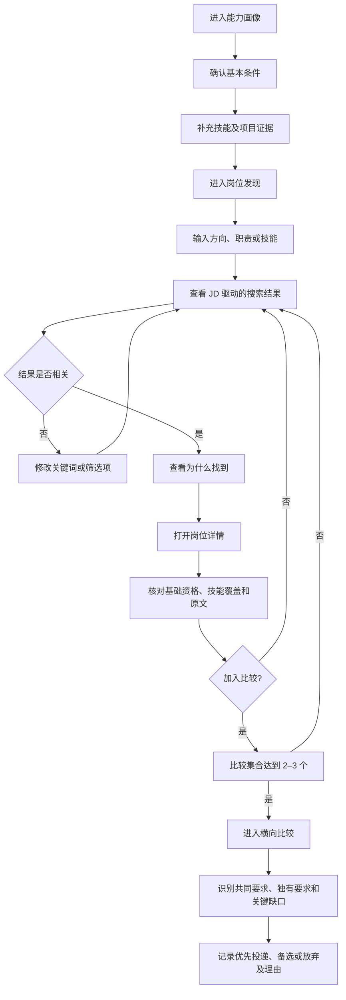

# 阶段 4 核心任务流 v1.0

## 测试目标

验证用户能否在不听产品介绍的情况下，从个人能力画像出发，找到名称不同但 JD 相关的岗位，理解资格与技能差距，并完成 2–3 个岗位的比较。

## 主任务流

## 系统决策点

1. **基础过滤**：明确不符合届次或学历的岗位移入“已排除”；信息不足的岗位保留并标记待核实。
2. **相关性排序**：职责 40%、技能 35%、专业/领域 15%、名称 10%。原型使用预计算结果，权重仅用于展示设计假设。
3. **技能判断**：required 缺口醒目展示；preferred 缺失不判定无资格。
4. **解释要求**：每个召回和判断至少对应一段 JD 或用户证据。
5. **最终决策**：系统组织证据，用户记录决定。

## 异常与回退流程

| 场景 | 页面反馈 | 用户下一步 |
|---|---|---|
| 没有搜索结果 | 提示减少条件或改用技能/职责词 | 清除部分筛选 |
| 用户技能信息不足 | 标记“待确认”，不推断会该技能 | 返回画像补充证据 |
| 只有一个比较岗位 | 禁用正式比较并提示至少选择两个 | 返回岗位发现 |
| 已选择三个岗位 | 其他卡片的加入按钮提示先移除一个 | 进入比较或移除 |
| JD 明确语言条件 | 放入“其他明确条件” | 用户自行核验，不参与召回排序 |

## 原型成功路径

种子用户使用“数据分析 / Python / 产品需求”等词搜索，能够发现：

- 名称直接相关的“AI 产品经理”；
- 名称较宽泛但职责相关的“产品经理”；
- 名称不同但包含数据分析、需求洞察和产品支撑职责的“经营分析与产品支撑”。

第三个岗位是阶段 4 必须验证的异名召回样本。
